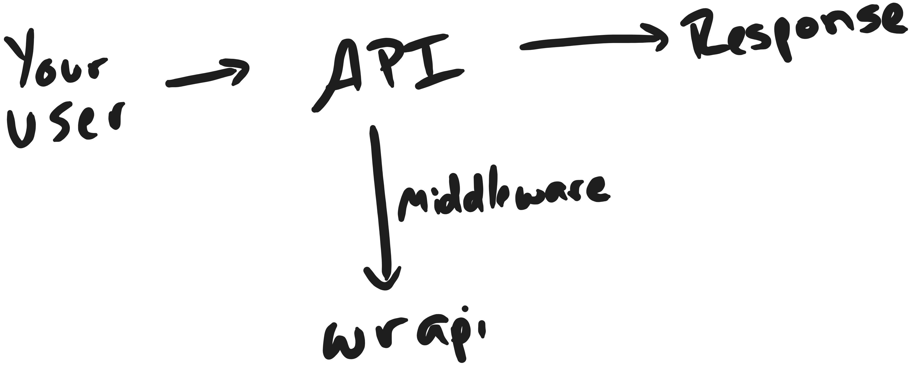

# Wrapi Demo

This is an example project for Wrapi using both NextJS and Hono. The setup is very similar between other API/backend frameworks, separate guides will be posted for a large number of frameworks in the [Docs](https://docs.wrapi.dev).

# Flow
Wrapi consists of 2 components, your your API integration and your frontend integration. 

The API integration is very short, requiring less than 20 lines of code. Its sole purpose is to log and track the requests made to your API endpoints. Your API will follow this flow:

The frontend integration may require more code depending on your solution. Wrapi gives you all the tools to create API keys, bill your users, and viewing usage. You must create a frontend to reflect all the data (from Wrapi) your API users may need.

# Demo Stack
- [NextJS](https://nextjs.org)
- [Better Auth](https://www.better-auth.com) (Authentication)
- [Prisma](https://prisma.io) (Database)
- [ShadCN](https://ui.shadcn.com) (UI Library)

# Structure
The [frontend folder](./frontend) contains the entire web facing application built with NextJS. This part handles the creation of API keys, linking users, and request tracking. Within the frontend, the user is able to:

1. Create an account (authorization)
2. Create API keys
3. Purchase API credits
4. View usage analytics for their created API keys

The [backend folder](./backend) contains your API. From there, requests are tracked, billing is applied, and anlytics are updated.